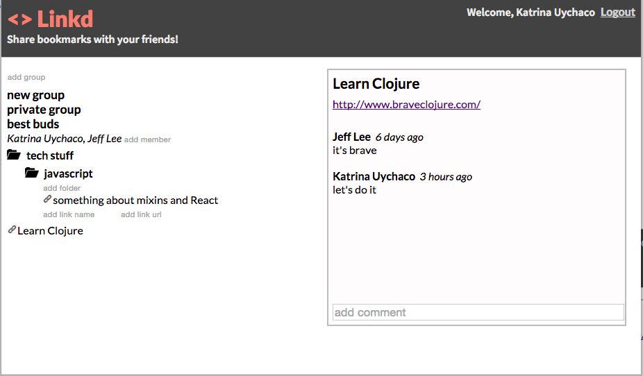

[](https://circleci.com/gh/PresentPath/Linkd)

# < > Linkd
_Share and discuss bookmarks with friends!_

Check it out: [linkd.herokuapp.com](https://linkd.herokuapp.com)

**Usage**

1. Log in using your google account
2. Create groups to share bookmarks with
3. Create folders to organize your links
4. Discuss links with friends!

**Table of Contents**

- [Screenshot](#screenshots)
- [Technologies](#technologies)
- [Interesting Aspect](#interesting-aspect)
- [Challenges](#challenges)
  - [Asynchronicity with Mocha Testing](#asynchronicity-with-mocha-testing) 
  - [React+Flux Rendering](#reactflux-rendering)


## Screenshot



## Technologies
**Server-side**

- Node.js - server-side JS runtime
- Express.js - server framework for Node.js 
- Mocha, Chai, Supertest - testing framework & libraries
- MySQL - relational database
- Sequelize - promise-based ORM
- Passport (Google strategy) - authentication middleware

**Client-side**

- React.js w/ JSX - view library
- Flux - application architecture
- Sass - CSS preprocessor

**Other**

- Webpack - module bundler
- CirclCI - continuous integration
- Heroku - hosting platform
- Bluebird - promise library

## Interesting Aspect

## Challenges

### Asynchronicity with Mocha Testing
#### Problem:
Asynchronous running of test spec files - During database testing, test spec files for the different models were being run asynchronously resulting in jumbled results output to the console. Also, the tests were being run before the database schema was fully loaded, resulting in a "Table doesn't exist" error. 

##### Jumbled test output:


We have two separate problems here:
1) Spec files being run asynchronously. 
2) Tests running before database is set up.

#### Solution:
1) This may not be the most elegant solution, but it's one that makes sense to me and allows me to have some fun with Promises. Surprisingly, Google searching didn't yield much, so just went with this implementation:

##### Exported spec files
Invoked callback in last test to resolve promise.
```javascript

module.exports = function(CALLBACK) {
  // User Controller
  describe('----- User Router/Controller tests -----', function() {
    
    it('should do stuff', function(done) { /* stuff */ });
    it('should do other stuff', function(done) { /* other stuff */ });
    it('should retrieve users from the database', function(done) {

        request(app)
          .get('/api/user/list')
          .end(function(err, res) {
            if (err) {
              CALLBACK(err);
              return done(err);
            }
            // assertions
            CALLBACK();
            done();
          });

    });
  });

};

```

##### Master spec file
Created promise chain to run tests synchronously.
```javascript

var userSpec = Promise.promisify(require('../User/userSpec.js'));
var groupSpec = Promise.promisify(require('../Group/groupSpec.js'));
var folderSpec = Promise.promisify(require('../Folder/folderSpec.js'));
var linkSpec = Promise.promisify(require('../Link/linkSpec.js'));
var commentSpec = Promise.promisify(require('../Comment/commentSpec.js'));

describe('database controller tests', function() {

  userSpec()
  .then(function() {
    return groupSpec();
  })
  .then(function() {
    return folderSpec();
  })
  .then(function() {
    return linkSpec();
  })
  .then(function() {
    return commentSpec();
  })
  .catch(function(err) {
    console.error('Error testing database controllers:', err);
  });

});
```


### React+Flux Rendering

#### Problem:
Issue rendering a Group component after adding a new group. Error message indicated that the `folders` object for the added group was `undefined` at the time of rendering.

I wouldn't actually consider this issue too big of a challenge, thanks in large part to the fact that I had refactored the entire frontend to use the Flux application architecture. 

In fact, the real challenge took place prior to the refactor. Initially, all of the state was held at the top level component of the app and there were tons of fun "Uncaught TypeError: Cannot read property X of undefined" or "Uncaught TypeError: undefined is not a function". The bug hunting process was a pain and the errors were mainly because the components would render before data was fully fetched from the server.

This particular bug was squashed in no time compared to previous bugs of a similar nature. Here's the approach I took and why it was so easy... 

#### Solution:

Be the interpreter... walked through the entire chain of operations:

GroupForm React View --> GroupAction Creator --> WebAPIUtils --> GroupAction Creator --> GroupStore --> Group React View

... realized very quickly that the GroupAction creator for receiving a newly created group was prematurely triggering a 'change' event.

Here's where the problem lied:  

```javascript
function createGroup (group) {
  $.post('/api/group/create', group)
    .done((response) => {
      var rawGroup = response[0];
      var rawFolder = response[1];
      GroupActions.receiveCreatedGroup(rawGroup); // Triggered unwanted change event
      GroupActions.updateSelectedGroup(rawGroup.id); // Triggered premature change event before root folder for group was added to store
      FolderActions.receiveCreatedFolder(rawFolder); // Signal to FolderStore to add root folder for new group
      FolderActions.updateSelectedFolderToRoot(rawGroup.id); // Sets display property so that views can be rendered appropriately
    })
    .fail((err) => {
      console.error('Error creating group', group.id, status, err.toString());
    });
}
```

Fixed the following two issues and things worked as expected:

1) Removed the change event emission in GroupActions.receiveCreatedGroup

2) Switched the order of these two actions:

```javascript
GroupActions.receiveCreatedGroup(rawGroup);
--> FolderActions.receiveCreatedFolder(rawFolder); // 
--> GroupActions.updateSelectedGroup(rawGroup.id);
FolderActions.updateSelectedFolderToRoot(rawGroup.id);
```

GroupActions.updateSelectedGroup was emitting a change event, prematurely triggering a re-render before FolderActions.receiveCreatedFolder triggered the addition of the root folder to FolderStore.
